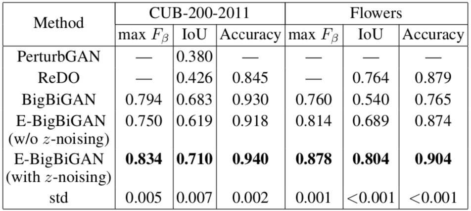

# Big GANs Are Watching You

This repository is the official implementation of [Big GANs Are Watching You: Towards Unsupervised Object Segmentation with Off-the-Shelf Generative Models](https://arxiv.org).
\
_Schematic representation of our approach._

Core steps:
1. Find the BigBiGAN latent direction responsible for background darkening and foreground lightening;
2. Sample real images embeddings and generate segmentation masks with their shifts;
3. Train U-net with that synthetic data.

\
_example of variation along the latent direction_

## Requirements

python 3.6 or later
>torch>=1.4\
torchvision>=0.5\
tensorboardX\
scikit-image\
scipy\
h5py

> at least 12Gb of GPU-memory for batch size 95 (though smaller batch gives competitive result)

For results visualization:
>jupyter

Optional for BigBiGAN tf to torch conversion and BigBiGAN embeddings evaluation:
> tensorflow_gpu==1.15.2\
tensorflow_hub\
parse

if troubles – check the authors packages versions in ```requirements.txt```

## Training

First run ```download_all.sh```\
this scrips downloads:
- BigBiGAN weights of the original tf-hub model (https://tfhub.dev/deepmind/bigbigan-resnet50/1) ported to pytorch;
- precalculated BigBiGAN-embeddings for some popular datasets;
- background darkening and foreground lightening latent directions coefficients.
> note that the ImageNet-BigBiGAN-embeddings takes 551Mb.

To train the U-net segmentation model, run this command:

```train
python train_segmentation.py \
    --out "results" \
    --gan_weights "BigGAN/weights/BigBiGAN_x1.pth" \
    --z "embeddings/BigBiGAN_ImageNet_z.npy"
    --bg_direction "BigGAN/weights/bg_direction.pth" \
    --val_images_dir __path_to_images_dir__ \
    --val_masks_dir __path_to_masks_dir__ \
```

## Custom Data

Once you want to use your own images BigBiGAN-embeddings, please run ```bigbigan_embeddings.ipynb``` notebook and provide your own data path.


## Evaluation

To check the synthetic data / segmentation samples / model metrics, please run
```inspection.ipynb``` notebook.

## Pre-trained Models

You can download pretrained models here:

- [U-net](https://www.dropbox.com/s/3nty6x7fwof7xyv/u_net_imagenet.pth) trained on ImageNet-BigBiGAN embeddings using default parameters.
- [U-net](https://www.dropbox.com/s/90odh34ddpjvuxk/u_net_cub2002011.pth) trained on CUB-200-2011-BigBiGAN embeddings using default parameters.
- [U-net](https://www.dropbox.com/s/fk8r9q0tvwaxbpl/u_net_flowers.pth) trained on Flowers-BigBiGAN embeddings using default parameters.

## Results

Our model achieves state-of-the-art results among fully unsupervised methods on many datasets.
Check Tables 1, 2, 3 of the original paper for more details.
In the tables below we refer our approach as BigBiGAN and E-BigBiGAN.

#### Object Detection


#### Saliency Detection


Here are some samples of the model performing on DUTS dataset:


## BigBiGAN weights conversion
Once the original BigBiGAN weigths are distributed within tfhub, we also provide the conversion code. See ```bigbigan2biggan.ipynb```. This code is based on this script: https://github.com/ajbrock/BigGAN-PyTorch/blob/master/TFHub/converter.py . Note that BigBiGAN and BigGAN almost share the architecture and we use the author's officially unofficial PyTorch BigGAN implementation.

## Licenses

- Unsupervised Discovery of Latent Directions: https://github.com/anvoynov/GANLatentDiscovery
- BigBiGAN weights: https://tfhub.dev/deepmind/bigbigan-resnet50/1
- BigGAN pytorch: https://github.com/ajbrock/BigGAN-PyTorch
- U-Net model code is based on: https://github.com/milesial/Pytorch-UNet
- prefetch_generator: https://github.com/justheuristic/prefetch_generator
